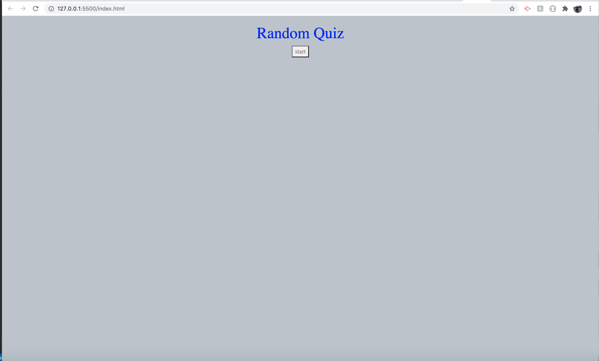
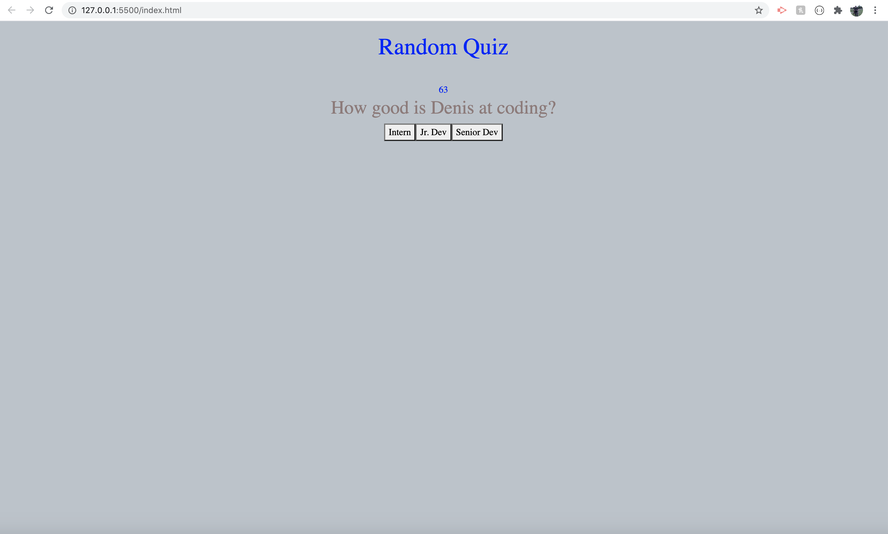
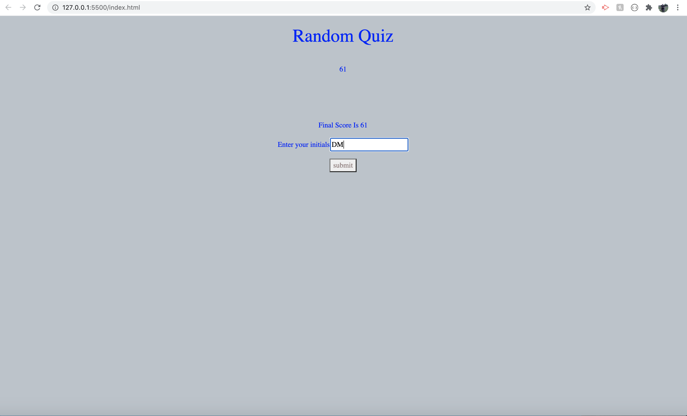

# 04 Web APIs: Code Quiz

* When the start button is clicked on you are presented with a question and the timer starts
* When you answer the question you are presented with the next question
* When you answer a question incorrectly time is subtracted
* If you do not complete the quiz within the given time, the quiz ends and you get a score of 0
* Once the quiz ends you are given your score
* Your score and initials are saved to local storage 

## Links

* https://denismatijevic.github.io/code-quiz/
* https://github.com/denismatijevic/code-quiz

## Challenges faced in the assignment

* It was difficult to syncronize the timer and the questions 

## Screenshots

